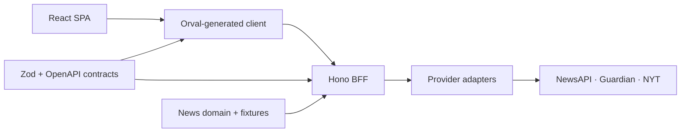

# Signal Desk

[](https://github.com/jb-thery/signal-desk/actions/workflows/ci.yml)
[](LICENSE)

Signal Desk is a responsive news aggregator that searches NewsAPI.org, The Guardian,
and The New York Times through one normalized, resilient interface. This case study
demonstrates React architecture, typed API integration, partial-failure handling,
security, testing, and reproducible delivery.

[Open the live static demo](https://jb-thery.github.io/signal-desk/). It uses deterministic
browser fixtures and requires no API credentials.

## AI-assisted engineering, human-owned delivery

This project demonstrates how I use AI professionally. I combine the speed of Codex
and Claude Code with nine years of engineering experience to define architecture,
control scope, challenge generated solutions, and validate every change. AI proposes
and accelerates implementation. I remain accountable for requirements, trade-offs,
security, testing, maintainability, and the final merge decision.

| Tool | Role in my workflow |
| --- | --- |
| JCode Skills | My private, self-maintained repository of reusable engineering workflows. I refine it as I learn from real delivery work. |
| Ragmir | My local-first retrieval library. I use it to analyze confidential source material locally and derive anonymized, traceable specifications without publishing the original brief. |
| Codex and Claude Code | Generate and refactor scoped implementations and test scaffolding from explicit constraints. |
| Agent Browser and Chrome DevTools MCP | Validate rendered behavior through the DOM, console, network, storage, accessibility tree, and responsive viewports. |

The JCode workflows used around this project stay deliberately focused:

| Skill | Responsibility |
| --- | --- |
| `docs-cartographer` | Reconciles documentation with repository and runtime evidence. |
| `browser-proof` | Captures browser behavior, console, network, accessibility, and viewport proof. |
| `dependency-tune-up` | Reviews dependency freshness, compatibility, and supply-chain risk. |
| `issue-forensics` | Moves from a reported symptom to root cause, scoped fix, and evidence. |
| `commit-surgeon` | Prepares reviewable, atomic changes only after local checks pass. |
| `skill-scout` and `skill-garage` | Vet and maintain third-party skills before adoption. |
| `ship` and `release-pilot` | Automate pull requests, CI checkpoints, promotion, and live verification. |

My delivery loop is evidence-driven:

1. Extract acceptance criteria, anonymize source material, and define boundaries.
2. Generate a constrained first implementation.
3. Run formatting, strict TypeScript, unit tests, and coverage.
4. Exercise the behavior in a real browser and iterate from runtime evidence.
5. Lock regressions with focused Vitest and Playwright coverage.
6. Prepare small Git changes, pull requests, and CI gates.
7. Review the diff and test the result myself as the final human reviewer.

No generated change is accepted solely because an AI tool or automated check reports
success. Third-party skills are also screened for source reputation, adoption,
security signals, project relevance, and overlap before use.


## Quick start

One-time toolchain setup:

```bash
mise trust
mise install
```

Then choose one primary command.

Local development, Vite on `5173` and Hono on `3001`:

```bash
mise run local
```

Docker review stack, published on `4174` after its healthcheck passes:

```bash
mise run docker
```

Stop the Docker stack with `mise run stop`. Both start commands install the pinned
pnpm dependencies when needed. No provider key is required for local review because
every real adapter has a deterministic fixture fallback. When the three server-side
keys are provided, the same build calls the live upstream APIs instead.

## Product behavior

- Debounced keyword search with shareable URL filters.
- Date, category, provider, and author filtering.
- Personalized feed by preferred sources, categories, and authors.
- Browser-local preferences, language, and theme with no account required.
- English and German UI with locale-aware dates and numbers.
- Loading, empty, error, and per-provider partial-success states.
- Responsive desktop and mobile layouts with semantic controls and visible focus.
- Live, mixed, mock, and serverless static-demo modes.

## Architecture

The pnpm monorepo keeps deployable apps separate from reusable contracts, domain
logic, fixtures, and UI primitives. Workspace packages never import application code.



Provider requests run in parallel and isolate failures, so one unavailable source does
not discard successful results. Hono routes generate the OpenAPI document, Orval
generates the browser client, and CI rejects generated-client drift.

| Concern | Choice |
| --- | --- |
| Monorepo | pnpm workspaces with `apps/*` and `packages/*` |
| Frontend | React 19, strict TypeScript 6, Vite 8, Tailwind CSS 4 |
| Navigation and data | TanStack Router, TanStack Query, URL state, `localStorage` preferences |
| API and contracts | Hono, Zod OpenAPI, Orval-generated fetch hooks |
| Sources | NewsAPI, Guardian, and NYT adapters with per-source fixture fallback |
| Accessibility and i18n | Semantic HTML, keyboard focus, reduced motion, English and German |
| Quality | Biome, TypeScript, Vitest, Playwright, React Doctor, commitlint, Husky |
| Delivery | Node 22, `mise`, multi-stage Docker, GitHub Actions, GitHub Pages |

More detail is available in [the architecture note](docs/architecture.md) and
[the API source note](docs/api-sources.md).

## Security and observability

- Provider credentials stay in server runtime variables and never enter the browser bundle.
- Vite exposes only public `VITE_*` values from the root environment configuration.
- Docker passes optional public PostHog settings as build arguments; provider keys remain runtime-only.
- Hono applies CSP, frame, referrer, permissions, object, and content-type protections.
- PostHog is disabled and excluded from the initial path unless its public key and host are configured.
- Telemetry records page paths, query length rather than query text, and captured application errors.
- A React error boundary, provider status strip, and `/api/health` expose client and runtime health.
- CI and Docker smoke tests verify health, search behavior, static delivery, and graceful shutdown.

This is review-grade observability, not a claim of a staffed production monitoring
service. A production rollout would add alerting, server traces, rate limiting, and
response caching.

## Quality and delivery

Local and CI gates cover:

- dependency auditing at `low` severity or higher;
- generated OpenAPI client drift;
- Biome formatting and lint;
- strict TypeScript across every workspace, root tooling, and Playwright tests;
- Vitest projects separated between Node and jsdom;
- enforced coverage thresholds on non-generated TypeScript logic;
- Playwright journeys on desktop and mobile Chromium for search, preferences, localization, layout and article links;
- production, static-demo, and GitHub Pages builds;
- non-root Docker build, health/search probes, and clean SIGTERM.

GitHub Actions separates `quality`, `browser`, and `container` jobs. The static
demo deploys from `main` only after the complete CI workflow succeeds. Exact,
date-stamped evidence lives in [the control checklist](docs/control-checklist.md).

## Engineering rules

- Apply KISS and YAGNI before adding abstractions or configuration.
- Use DRY and SOLID at proven boundaries such as provider adapters and contracts.
- Keep strict types at system boundaries and avoid `any`, ignored errors, and unsafe casts.
- Replace meaningful magic strings and numbers with named constants or shared contracts.
- Remove dead, duplicated, obsolete, commented-out, or debug code.
- Prefer focused components and behavior tests over speculative frameworks.
- Treat secrets, accessibility, localization, generated code, and human review as release gates.

## Useful commands

| Command | Purpose |
| --- | --- |
| `mise run local` | Install dependencies and start Vite plus Hono. |
| `mise run docker` | Build and start the healthy Docker stack on `4174`. |
| `mise run stop` | Stop and remove the local Docker stack. |
| `mise run verify` | Run Biome, TypeScript, coverage, and the production build. |
| `mise run docker:verify` | Build, smoke-test, and remove the Docker stack. |
| `mise exec -- pnpm test:e2e` | Run desktop and mobile Playwright journeys. |
| `mise exec -- pnpm build:static-demo` | Build the fixture-only browser demo. |
| `mise exec -- pnpm generate:api` | Regenerate OpenAPI and the Orval client. |

The repository pins Node `22.22.3` and pnpm `10.34.4`. Use `mise exec -- pnpm`
or `corepack pnpm` instead of an unrelated global pnpm version.

## Runtime modes and configuration

| Mode | Behavior |
| --- | --- |
| Mock | No provider keys, all adapters return local fixtures. |
| Mixed | Configured sources are live, remaining sources use fixtures. |
| Live | All three adapters call their upstream APIs from Hono. |
| Static demo | The browser uses fixtures without a server or API requests. |

Copy [`.env.example`](.env.example) to `.env` only when configuration is needed.
Server secrets use `NEWS_API_KEY`, `GUARDIAN_API_KEY`, and `NYT_API_KEY`.
Public PostHog settings use `VITE_PUBLIC_POSTHOG_KEY` and
`VITE_PUBLIC_POSTHOG_HOST`. Set `MOCK_FAIL_PROVIDER` to demonstrate partial
failure without changing code.

## Deliberate trade-offs

- Preferences remain local because account sync and authentication are outside the brief.
- The static demo is fixture-only; live providers require the Hono runtime.
- Provider quotas and permitted use must be reviewed before production deployment.
- Pagination and cross-publisher deduplication remain natural data-layer extensions.

The durable, anonymized requirements are preserved in
[the case study brief](docs/case-study-brief.md). Identifying source documents are
intentionally not tracked.
