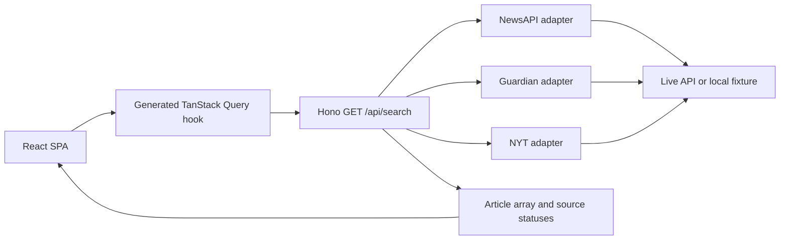

# Signal Desk

Signal Desk is a responsive news aggregator that searches NewsAPI.org, The Guardian and The New York Times through one normalized, resilient interface.

It is built as a frontend case study with React 19, strict TypeScript, TanStack Query and Router, a contract-first Hono BFF, generated API types, deterministic mock data and production builds for both Docker and serverless static hosting.


## Quick start

The fastest path uses Docker. No API key is required because the server automatically serves realistic fixtures when credentials are absent.

```bash
docker compose up --build
```

Open [http://localhost:3000](http://localhost:3000). The OpenAPI documentation is available at [http://localhost:3000/docs](http://localhost:3000/docs).

For local development:

```bash
corepack enable
corepack prepare pnpm@10.16.1 --activate
pnpm install
pnpm dev
```

The Vite application runs on [http://localhost:5173](http://localhost:5173) and proxies API calls to the Hono server on port `3000`.

## Features

- Debounced keyword search with state stored in the URL.
- Date, category, provider and author filters with shareable URLs.
- Personalized feed by preferred sources, categories and authors.
- Browser-local preference persistence with no account required.
- English and German interface with locale-aware dates.
- Light and dark themes, responsive layout and 44 px touch targets.
- Loading, empty, error and partial-provider failure states.
- Three provider adapters normalized to one `Article` contract.
- Live, mixed and mock runtime modes shown in the interface.
- PostHog wiring that is a complete no-op unless public configuration is present.
- Swagger UI and a generated OpenAPI client.

## Architecture

The browser never receives provider credentials. It makes one request to the BFF, which fans out to the selected providers and returns normalized articles plus one status per source.



The provider layer applies the Adapter pattern. Every implementation satisfies `ArticleProvider` and translates an upstream payload into the Zod-backed `Article` schema. Adding a provider does not change the UI or the query client.

The API workflow is contract-first:

1. `@hono/zod-openapi` derives the OpenAPI document from the server schemas.
2. Orval generates the TypeScript models, fetch functions, TanStack Query hooks and MSW handlers.
3. CI regenerates the client and fails if committed output has drifted.

This separation keeps the UI focused, avoids duplicated API types and allows each provider to fail independently. It applies SOLID at a useful boundary while keeping the rest of the application deliberately small and direct.

## Data modes

| Mode | Trigger | Behavior |
| --- | --- | --- |
| Mock | No provider keys | All adapters use deterministic local fixtures. This is the default Docker experience. |
| Mixed | Some provider keys | Configured providers are live and missing providers continue with fixtures. |
| Live | All provider keys | All three adapters call their upstream APIs from the server. |
| Static demo | `VITE_ENABLE_MOCK_DATA=true` at build time | The browser serves the same normalized fixtures without an API server or API requests. |

Set `MOCK_FAIL_PROVIDER` to `newsapi`, `guardian` or `nytimes` to demonstrate the partial-success UI without changing code.

## Configuration

Copy `.env.example` to `.env` only when live API access is needed. Never expose provider keys with a `VITE_` prefix.

| Variable | Scope | Purpose |
| --- | --- | --- |
| `NEWS_API_KEY` | Server secret | NewsAPI.org credential. |
| `GUARDIAN_API_KEY` | Server secret | Guardian Open Platform credential. |
| `NYT_API_KEY` | Server secret | New York Times API credential. |
| `NEWS_API_BASE_URL` | Server | Optional NewsAPI endpoint override. |
| `GUARDIAN_API_BASE_URL` | Server | Optional Guardian endpoint override. |
| `NYT_API_BASE_URL` | Server | Optional NYT endpoint override. |
| `PORT` | Server | Runtime port, default `3000`. |
| `MOCK_FAIL_PROVIDER` | Server | Simulates one provider failure. |
| `VITE_PUBLIC_POSTHOG_KEY` | Browser public | Enables analytics only when set with a host. |
| `VITE_PUBLIC_POSTHOG_HOST` | Browser public | PostHog reverse-proxy path, default `/ingest`. |
| `VITE_ENABLE_MOCK_DATA` | Browser build | Replaces API calls with local fixtures for a serverless demo build. |

## Commands

```bash
pnpm check          # Biome format and lint verification
pnpm typecheck      # strict TypeScript check
pnpm test           # Vitest unit and integration suite
pnpm test:coverage  # coverage report
pnpm test:e2e       # Playwright Chromium smoke suite
pnpm build          # production client and standalone server bundle
pnpm build:static-demo # serverless client bundle with local fixtures
pnpm preview        # serve the production build
pnpm preview:static # serve the latest client bundle on all interfaces
pnpm generate:api   # OpenAPI document and Orval client
```

Install Chromium once before the first local E2E run if needed:

```bash
pnpm exec playwright install chromium
```

## Quality evidence

- Biome check, strict TypeScript and production build pass locally.
- 14 Vitest tests cover adapters, partial failures, search semantics, preferences and static responses.
- 2 Playwright smoke tests cover URL filters and persisted personalization.
- The Docker image builds and runs as the non-root `node` user.
- Container smoke checks confirm the SPA, `/api/health` and three-source mock search.
- Browser verification covers desktop, mobile, dark mode, German, persistence and partial success.
- The static demo supports direct route loads and persisted preferences with no fetch or XHR requests.
- Mobile Lighthouse snapshot: Accessibility 100, Best Practices 100, SEO 100, Agentic Browsing 100.

The mobile capture is available at [docs/screenshots/search-mobile.webp](docs/screenshots/search-mobile.webp).

## Security

- Provider keys are read only from server runtime variables.
- `.env` files are ignored and never copied into the Docker image.
- The same-origin BFF avoids browser CORS workarounds and key leakage.
- CSP, frame, referrer, permissions and content-type headers are set by Hono.
- PostHog is disabled by default and uses the same-origin `/ingest` proxy when enabled.

## Trade-offs and next steps

- Mock article images use remote Unsplash URLs, so the text experience remains available if an image host is offline.
- Upstream plans, quotas and permitted use vary by provider and must be reviewed before production use.
- Preferences intentionally stay in `localStorage`; account sync is outside this case study.
- The serverless static demo is intentionally fixture-only; live providers require the Hono runtime.
- Result pagination and deduplication across syndication partners would be the next data-layer improvements.
- A production deployment should add request-level rate limiting and server-side response caching.

## Repository map

```text
server/                 Hono API, OpenAPI schemas and provider adapters
src/api/generated/      Orval-generated models, hooks and MSW handlers
src/features/search/    URL-backed search and filters
src/features/preferences/ Local preferences and personalized feed logic
src/routes/             TanStack Router route components
src/components/         UI, states and application shell
tests/e2e/              Playwright smoke tests
docs/                   Brief, source notes, checklist and screenshots
```

The original assignment is preserved in `source-materials/cs-frontend-developer-2025.pdf`.
