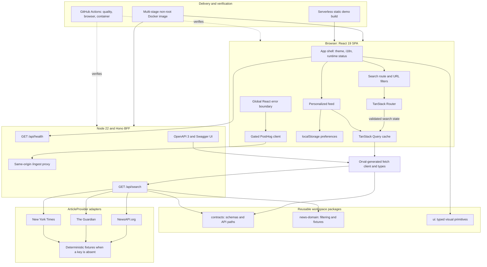

# Signal Desk

[](https://github.com/jb-thery/signal-desk/actions/workflows/ci.yml)
[](LICENSE)

Signal Desk is a responsive news aggregator that searches NewsAPI.org, The Guardian,
and The New York Times through one normalized and resilient interface. It is a frontend
case study focused on React architecture, typed API integration, partial-failure handling,
testability, security, and reproducible delivery.

[Open the live static demo](https://jb-thery.github.io/signal-desk/).
It uses deterministic fixture data in the browser and requires no API credentials.


## Quick start

No API key is required. On the first run, trust the repository configuration and install
the pinned Node runtime:

```bash
mise trust
mise install
```

Then choose one of the two primary commands.

Local development with Vite and Hono:

```bash
mise run local
```

Open [http://localhost:5173](http://localhost:5173). Dependencies are installed automatically.

Docker review stack:

```bash
mise run docker
```

Open [http://localhost:4174](http://localhost:4174). The OpenAPI document and Swagger UI
are available at [http://localhost:4174/openapi.json](http://localhost:4174/openapi.json)
and [http://localhost:4174/docs](http://localhost:4174/docs).

Stop the Docker stack with:

```bash
mise run stop
```

The legacy names `mise run docker:up` and `mise run docker:down` remain available as aliases.
Set `PORT`, `VITE_API_PORT`, or `APP_PORT` before a command only when custom ports are needed.

## Local development

Requirements without `mise`: Node 22 and Corepack.

```bash
corepack enable
corepack pnpm install --frozen-lockfile
corepack pnpm dev
```

Vite serves [http://localhost:5173](http://localhost:5173). With `mise run local`, it proxies
same-origin calls to Hono on port `3001`; raw `pnpm dev` keeps the server default on port
`3000`. For live providers, export the server variables before starting the stack. Docker
Compose reads them from an ignored `.env` file.

## Product behavior

- Debounced keyword search with shareable URL state.
- Date, category, provider, and author filters.
- Personalized feed by preferred sources, categories, and authors.
- Browser-local preferences, language, and theme with no account required.
- English and German UI with locale-aware dates.
- Loading, empty, error, and per-provider partial-success states.
- Responsive desktop and mobile layouts with semantic controls and visible focus.
- Live, mixed, mock, and serverless static-demo modes.

## Architecture and data flow

The codebase is a pnpm monorepo. Applications own deployable runtime code, while reusable
contracts, domain logic, fixtures, and UI primitives live in workspace packages. Dependencies
flow from `apps/*` to `packages/*`; packages never import application code.



The provider layer uses the Adapter pattern. Each `ArticleProvider` translates one
upstream response into the Zod-backed `Article` contract. Provider requests run in
parallel and isolate errors, so one failed source does not discard successful results.

The API is contract-first:

1. Hono routes and Zod schemas produce `openapi.json`.
2. Orval generates models, fetch functions, and TanStack Query hooks.
3. CI regenerates the client and fails if committed output has drifted.

This keeps source-specific code at the BFF boundary, browser code independent of API
payload shapes, and provider secrets outside the client bundle.

SOLID, DRY, and KISS are applied at concrete boundaries: one responsibility per adapter,
one generated contract shared by server and browser, small route components, URL state for
shareable filters, and `localStorage` only for user-owned preferences. There is no generic
repository layer or speculative provider framework.

## Stack

| Concern | Choice |
| --- | --- |
| UI | React 19, TypeScript 6 strict mode, Vite 8 |
| Routing and state | TanStack Router, URL filters, `localStorage` preferences |
| Server state | TanStack Query with bounded retry and cache policies |
| API | Hono, Zod OpenAPI, Orval-generated fetch client |
| Data sources | NewsAPI, Guardian, and NYT adapters with fixture fallback |
| Styling | Tailwind CSS 4, CSS tokens, CVA-based components |
| Localization | i18next and react-i18next, English and German |
| Observability | Environment-gated PostHog and a global React error boundary |
| Quality | Biome, strict TypeScript, Vitest, Playwright, commitlint, Husky |
| Delivery | Node 22, Docker Compose, `mise`, GitHub Actions |

## Runtime modes

| Mode | Trigger | Behavior |
| --- | --- | --- |
| Mock | No provider keys | All adapters return local fixtures. This is the default review mode. |
| Mixed | Some provider keys | Configured sources are live; the others continue with fixtures. |
| Live | All provider keys | All adapters call their upstream APIs from the server. |
| Static demo | `VITE_ENABLE_MOCK_DATA=true` during build | The browser uses fixtures without a server or API requests. |

Set `MOCK_FAIL_PROVIDER` to `newsapi`, `guardian`, or `nytimes` to demonstrate partial
success without changing code.

## Configuration

Copy `.env.example` to `.env` only for Docker or other runtime configuration. Never add
provider credentials to a `VITE_` variable.

| Variable | Scope | Purpose |
| --- | --- | --- |
| `NEWS_API_KEY` | Server secret | NewsAPI.org credential. |
| `GUARDIAN_API_KEY` | Server secret | Guardian Open Platform credential. |
| `NYT_API_KEY` | Server secret | New York Times API credential. |
| `NEWS_API_BASE_URL` | Server | Optional NewsAPI endpoint override. |
| `GUARDIAN_API_BASE_URL` | Server | Optional Guardian endpoint override. |
| `NYT_API_BASE_URL` | Server | Optional NYT endpoint override. |
| `PORT` | Server | Container/runtime port, default `3000`. |
| `APP_PORT` | Docker host | Published host port, default `3000`. |
| `MOCK_FAIL_PROVIDER` | Server | Simulates one provider failure. |
| `VITE_PUBLIC_POSTHOG_KEY` | Browser public | Enables analytics only when a host is also configured. |
| `VITE_PUBLIC_POSTHOG_HOST` | Browser public | Same-origin PostHog proxy path, normally `/ingest`. |
| `VITE_ENABLE_MOCK_DATA` | Build-time public | Enables the serverless fixture-only build. |
| `VITE_API_PORT` | Local browser | Hono port used by the Vite development proxy, default `3000`. |

## Security and observability

- Provider credentials exist only in server runtime variables.
- `.env` files are excluded from Git and Docker build context.
- The browser calls the same-origin BFF, never secret-bearing provider endpoints.
- Hono sets CSP, frame, referrer, permissions, object, and content-type protections.
- Swagger receives a route-specific jsDelivr allowance; the SPA does not allow inline scripts.
- PostHog is disabled unless both public variables are present and uses `/ingest` when enabled.
- Pageviews contain only the pathname; search events contain query length, not search text.
- `capture_exceptions` handles global failures and the root error boundary captures React errors.
- pnpm enforces release age and trust-downgrade checks; CI fails on any known audit finding.

## Quality gates

Current local evidence:

- 41 Vitest tests across provider normalization, filtering, preferences, analytics,
  API behavior, partial failure, and static responses.
- Enforced coverage minimums: 80% statements, lines, and functions; 65% branches.
- Current broad TypeScript logic coverage: 82.59% statements, 82.14% lines, 84.81% functions,
  and 66.48% branches.
- 6 Playwright scenarios across desktop Chromium and a Pixel 5 viewport.
- Production SPA, standalone Hono server, and fixture-only static builds.
- Multi-stage Docker build, non-root runtime, healthcheck, API smoke tests, and clean SIGTERM.
- Mobile browser proof: semantic controls, no horizontal overflow, clean console, and healthy API responses.

GitHub Actions separates three jobs:

- `quality`: dependency audit, generated-client drift, Biome, TypeScript, coverage, and builds.
- `browser`: Playwright on desktop and mobile Chromium profiles.
- `container`: image build, health/search probes, and graceful shutdown.

The separate `Deploy static demo` workflow publishes the fixture-only build to GitHub Pages
after each successful promotion to `main`.

## Commands

| Command | Purpose |
| --- | --- |
| `mise run local` | Install dependencies and start Vite plus Hono locally. |
| `mise run docker` | Build and start the healthy Docker stack on port `4174`. |
| `mise run stop` | Stop and remove the project Docker stack. |
| `mise run verify` | Run coverage plus the complete production build. |
| `mise run docker:verify` | Build, smoke-test, and remove the Docker stack. |
| `pnpm dev` | Run Vite and Hono in watch mode. |
| `pnpm check` | Verify Biome formatting, imports, and lint rules. |
| `pnpm typecheck` | Run strict TypeScript without emitting files. |
| `pnpm test` | Run the Vitest suite. |
| `pnpm test:coverage` | Run Vitest and enforce coverage thresholds. |
| `pnpm test:e2e` | Run desktop and mobile Playwright scenarios. |
| `pnpm build` | Build the SPA and standalone Hono server. |
| `pnpm build:pages` | Build the GitHub Pages demo with repository base path and hash routing. |
| `pnpm build:static-demo` | Build the fixture-only serverless SPA. |
| `pnpm generate:api` | Regenerate OpenAPI and the Orval client. |
| `pnpm verify:fast` | Run Biome, TypeScript, and Vitest before push. |

Install Chromium once before a local E2E run if needed:

```bash
pnpm exec playwright install chromium
```

## Repository map

```text
apps/frontend/              React SPA, Vite configuration, public assets, and browser tests
apps/backend/               Hono API, provider adapters, security middleware, and Node bundle
packages/contracts/         Zod/OpenAPI schemas and shared application/API paths
packages/news-domain/       Shared filtering, deterministic fixtures, and fixture assets
packages/ui/                Reusable typed UI primitives and their CSS contract
docs/                       Anonymized brief, implementation notes, checklist, and screenshots
Dockerfile                  Production build for the frontend and backend workspace apps
pnpm-workspace.yaml         Workspace membership and dependency security policy
```

## Deliberate trade-offs

- Preferences remain local because account sync and authentication are outside the brief.
- The static demo is fixture-only; live providers require the Hono runtime.
- Mock mode uses self-hosted fixture artwork; live provider image failures fall back to a branded placeholder.
- Provider plans, quotas, and permitted use must be reviewed before production deployment.
- A production rollout should add server-side response caching and request rate limiting.
- Pagination and cross-publisher deduplication are natural next data-layer improvements.

The identifying source documents are intentionally not tracked. The durable, anonymized
requirements are preserved in [`docs/case-study-brief.md`](docs/case-study-brief.md).
