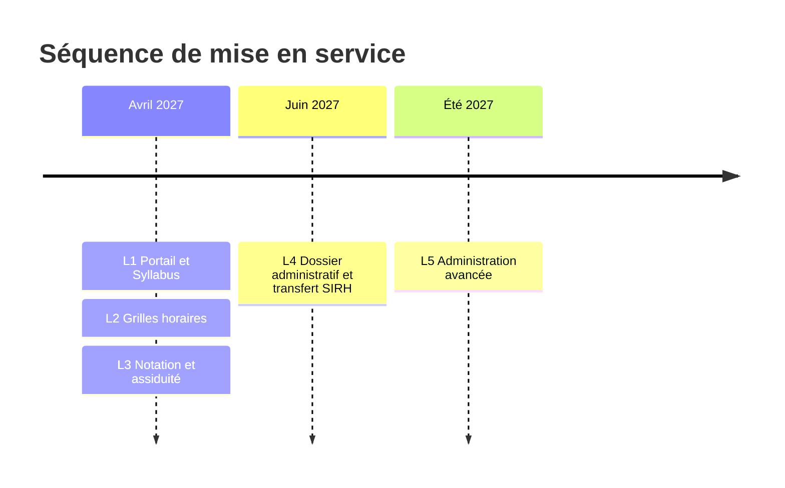
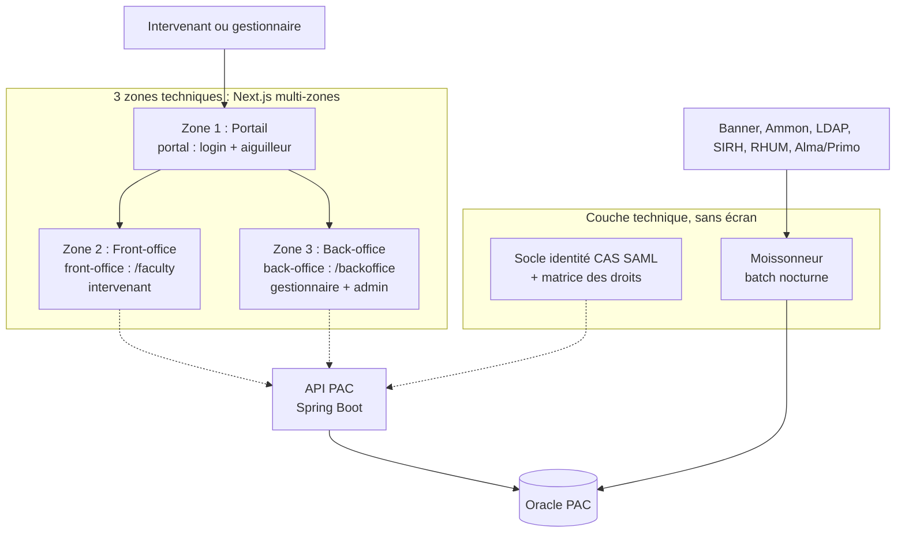
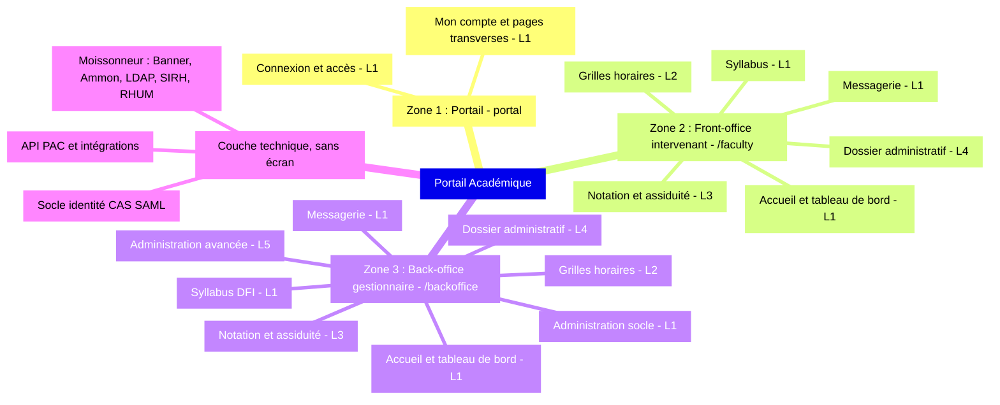
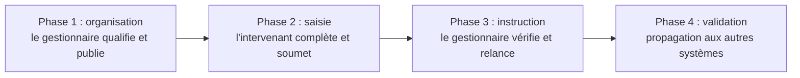
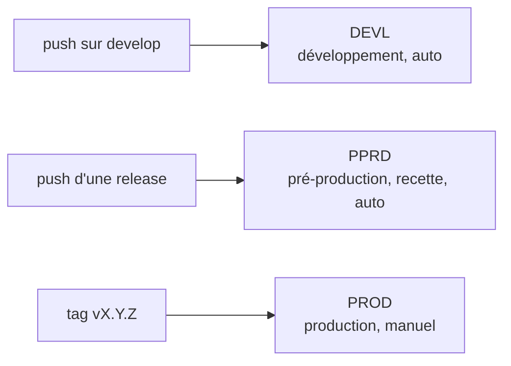

# Portail Académique - carte des écrans

> Vue d'ensemble fonctionnelle issue du corpus projet, vérifiée par recoupement des sources
> (spécifications, livrables Syllabus / Grilles horaires / Moissonneur / Messagerie, matrice
> des profils et droits, chiffrage détaillé, plannings Direction et Kick-Off). Représente la
> cible des spécifications, pas nécessairement l'état codé aujourd'hui.

## Le modèle mental

- Il n'y a pas d'application "Syllabus" ou "Grille horaire" séparée. Il y a **3 zones
  techniques** Next.js (`portal`, `front-office`, `back-office`) qui hébergent des
  **modules fonctionnels**.
- Un même module a **deux faces** : le Syllabus, les Grilles horaires et le Dossier
  administratif existent côté intervenant (front-office, il saisit) et côté gestionnaire
  (back-office, il instruit et valide). Même métier, deux profils.
- Le **moissonneur** n'est ni une zone ni un écran : c'est un service back-end (batch
  nocturne qui aspire Banner, Ammon, LDAP, SIRH et RHUM vers l'Oracle PAC). Ses seules
  surfaces visibles : l'écran de rapprochement et l'écran de supervision technique, côté
  administration.
- La **messagerie** est un vrai module utilisateur (fils de discussion par thématique),
  présent côté intervenant et côté gestionnaire, pas seulement un outil d'admin.

## Séquence de livraison (le point clé)

L'institution a **re-priorisé** les livraisons. Attention au piège : le Dossier administratif
a été **spécifié en premier** (itération 1, fondations + DA), mais son **usage réel ne commence
qu'en juillet**, donc sa **mise en service est décalée au Livrable 4 (juin 2027)**. Ce qui est
livré d'abord, c'est le socle et le Syllabus.

| Livrable | Contenu | Mise en service |
|----------|---------|-----------------|
| L1 | Portail / socle (identité, connexion, aiguilleur, messagerie, dashboards) + Syllabus | Avril 2027 |
| L2 | Grilles horaires | Avril 2027 |
| L3 | Notation & assiduité, séances, emploi du temps, actualités, ressources | Avril 2027 |
| L4 | Dossier administratif + transfert SIRH automatisé | Juin 2027 |
| L5 | Administration avancée (gestion des gestionnaires, fusion comptes, tables de référence) | Été 2027 |

Dans la carte, la couleur des modules suit le **jalon de mise en service** (avril / juin / été
2027) et le badge L1 à L5 précise le livrable.

## Architecture des zones

## Carte des écrans (vue synthétique)

## Détail des écrans par zone

### Zone 1 : Portail (`portal`)

Entrée commune à tous les profils. Livrable 1, mise en service avril 2027.

- **Connexion et accès**
  - Connexion CAS et LDAP
  - Comptes locaux : activation, réinitialisation par token
  - Aiguilleur : choix de profil, redirection
  - Réactualisation des droits à la connexion
- **Compte et pages transverses**
  - Mon compte
  - Gestion des notifications
  - Pages légales et accessibilité

### Zone 2 : Front-office intervenant (`front-office`, `/faculty`)

Enseignant, vacataire, contributeur ExEd.

- **Accueil et tableau de bord** (L1, avril 2027)
  - Dashboard, cartes dynamiques par profil
  - Sciences Po et moi
  - Mes enseignements
  - Mes démarches
  - Aide, FAQ, tutoriels
  - Contacts utiles
- **Syllabus** (L1, avril 2027)
  - Mes syllabi, avec alerte de complétion
  - Mes enseignements, à onglets
  - Édition du syllabus, par sections
  - Références bibliographiques : avec Alma ou hors Alma
  - Plan détaillé des séances
  - Transfert du bâton d'édition
  - Historique et audit des actions
- **Messagerie** (L1, avril 2027)
  - Fils de discussion, par thématique
  - Notifications
- **Grilles horaires** (L2, avril 2027)
  - Notification et card UP
  - Saisie des disponibilités (GH7)
  - Consultation des créneaux proposés (GH8)
  - Créneau et salle définitifs, retour du planning
- **Notation et assiduité** (L3, avril 2027)
  - Mes séances à venir
  - Emploi du temps
  - Assiduité, saisie par séance
  - Notation, grilles d'évaluation
  - Trombinoscope
  - Actualités et ressources numériques
- **Dossier administratif** (L4, juin 2027)
  - Dashboard, carte DA dynamique
  - Saisie du DA, stepper en 4 étapes plus résumé
  - Pièces justificatives, avec visionneuse
  - Soumission et suivi de statut
  - Demandes d'actualisation
  - Congés et indisponibilités
  - Mes attestations en PDF
  - Historique des actions

### Zone 3 : Back-office gestionnaire (`back-office`, `/backoffice`)

Gestionnaire, DFI, PASE, RH, planning, administrateur.

- **Accueil et tableau de bord** (L1, avril 2027)
  - Dashboard gestionnaire, rubriques
  - Cartes de suivi par module
- **Syllabus, DFI** (L1, avril 2027)
  - Accueil, card "Suivi de mes syllabi"
  - Liste des syllabi, avec recherche
  - Consultation et édition
  - Validation ou renvoi motivé
  - Dates de complétion, en masse
  - Transfert des droits
  - Gestion des RP, association Banner
- **Messagerie** (L1, avril 2027)
  - Contacter, unitaire ou massif
  - Composition, gabarits et variables
  - Non-lus et filtres
- **Administration, socle** (L1, avril 2027)
  - Accueil administration
  - Comptes
  - Écran de rapprochement, moissonneur
  - Supervision technique, journal des jobs
  - Types de pièces jointes et validation RH
  - Dates et délais du DA
  - Paramétrage des syllabus, sections
  - Modèles de notifications
  - Traductions FR et EN
- **Grilles horaires** (L2, avril 2027)
  - Tableau de bord
  - Aiguillage
  - Gestion des grilles (GH2)
  - Constituer ou modifier une grille (GH3)
  - Vivier d'UP et campagne (GH4)
  - Affectation grille vers UP (GH5)
  - Détail des disponibilités (GH6)
  - Saisie déléguée (GH9)
  - Aperçu enseignant (GH10)
  - Gabarits de créneaux
  - Récapitulatif Planning, lecture seule (GH11)
- **Notation et assiduité** (L3, avril 2027)
  - Suivi de l'assiduité
  - Suivi de la notation
- **Dossier administratif** (L4, juin 2027)
  - Organisation de campagne
  - Suivi de campagne, KPIs
  - Fiche administrative, validation à 2 niveaux, régime RH
  - Gestion des reliquats, mode substitution
  - Cas particuliers, 67 ans, abandonnés, hors campagne
  - Exports
- **Administration avancée** (L5, été 2027)
  - Gestion des gestionnaires, création et droits
  - Mode supervision et shadow
  - Fusion des comptes
  - Liste et fiche intervenant
  - Notifications manuelles
  - Ressources numériques et aide en ligne
  - Tables de référence

### Couche technique (sans écran)

Services back-end qui alimentent les 3 zones.

- Moissonneur : Banner, Ammon, LDAP, SIRH, RHUM, en mode delta
- Socle identité numérique : CAS SAML, cycle de vie des comptes
- API PAC : exports, destination fabrique à maquettes
- Transfert SIRH : SFTP des pièces validées, purge après intégration
- Intégrations : Alma et Primo, service Planning et Banner SSASECT

## Parcours du dossier administratif en 4 phases

## Chaîne de déploiement (GitFlow)

Aujourd'hui, seule la plateforme DEVL est provisionnée. À ne pas confondre avec les 5
livrables L1 à L5 : les livrables sont des jalons fonctionnels dans le temps, DEVL / PPRD /
PROD sont les 3 serveurs sur lesquels chaque version est déployée.

## Réserves de lecture

- Document = cible fonctionnelle des spécifications, pas l'état codé au jour de rédaction.
  Le plus avancé est le socle : authentification, matrice des droits, menu.
- La séquence de livraison vient du planning Direction et du Kick-Off : le DA a été
  spécifié en itération 1 mais sa mise en service est décalée en L4 (juin 2027).
- Numérotation des grilles horaires : la spécification comporte deux versions, l'une avec un
  tableau de bord GH0 et un aiguillage GH1, l'autre avec le tableau de bord en GH1. Les écrans
  enseignant sont GH7 (saisie) et GH8 (consultation) ; le Planning dispose du GH11 en lecture
  seule.
- L'inventaire des écrans intervenant est reconstitué à partir des parcours, du Gantt design
  et de la matrice des profils et droits ; les écrans gestionnaire des grilles sont
  explicitement numérotés dans la spécification.
- Sources principales : `01a_Spécifications_PortailAcademique_Lot1_Itération1`,
  `Syllabus_Spécifications_PortailAcademique_Lot1_V1.1`,
  `SFD_PortailAcademique_Lot1_Itération2_GrillesHoraires`,
  `PAC_Messagerie_Centralisee_Specs`, `ECR_SPEC_001_Ecran_de_rapprochement`,
  `RECSI ... Itération 1 ... Annexe 1 Chiffrage Détaillé` (blocs D, E, F, G, H et Gantt design),
  `PortailAca_Direction_Planning`, `PortailAcadémique - Kick-Off`,
  `Portail Aca _ Matrice_Profils_Droits_V5`, `planning_portail_academique`.
